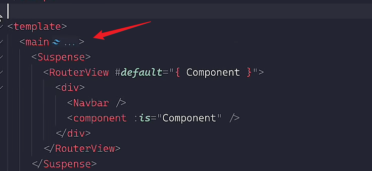

# Tailwind CSS 

## apply

Tailwind CSS 提供了 `@apply` 指令，允许开发者将多个 Tailwind 工具类应用到一个自定义的 CSS 类中。通过使用 `@apply`，你可以轻松地复用样式、减少重复代码并让 CSS 文件更加简洁。

### 1. 什么是 `@apply`？

`@apply` 是 Tailwind CSS 提供的一个 CSS 指令，它允许你将 Tailwind 的工具类（utility classes）直接应用到自定义的 CSS 类中。这种方法使得在项目中定义组件样式时更加简洁和高效。

例如，假设你有一组 Tailwind 工具类，想要将它们封装成一个自定义的 CSS 类，你可以使用 `@apply` 来将它们组合在一起。

```css
/* 使用 @apply 将 Tailwind 工具类应用到 .button 类中 */
.button {
  @apply px-4 py-2 bg-blue-500 text-white rounded-md;
}
```

在上面的示例中，`@apply` 将 `px-4`, `py-2`, `bg-blue-500`, `text-white`, `rounded-md` 等多个工具类的样式应用到 `.button` 类中。

### 2. `@apply` 的语法

`@apply` 的基本语法如下：

```css
@apply <utility-classes>;
```

你可以将多个工具类用空格分隔，直接写在规则块中。例如：

```css
/* 自定义按钮样式 */
.button {
  @apply px-4 py-2 bg-blue-600 text-white rounded-lg font-bold shadow-md;
}
```

### 3. 使用场景

#### 3.1. 创建可复用的组件样式

当你在多个地方需要使用相同的样式时，`@apply` 可以帮助你避免重复，保持样式的一致性。例如，为了创建一个按钮样式：

```css
/* 定义一个可复用的按钮样式 */
.btn {
  @apply px-4 py-2 bg-blue-600 text-white font-semibold rounded-md;
}

/* 按钮悬停状态 */
.btn:hover {
  @apply bg-blue-700;
}

/* 按钮聚焦状态 */
.btn:focus {
  @apply outline-none ring-2 ring-blue-500;
}
```

#### 3.2. 简化长样式

如果你有复杂的样式，并且需要在多个地方复用这些样式，使用 `@apply` 可以简化这些样式，使得 CSS 更加简洁：

```css
/* 为卡片组件定义样式 */
.card {
  @apply bg-white shadow-lg rounded-lg p-6;
}

/* 卡片头部 */
.card-header {
  @apply text-xl font-bold text-gray-800 mb-4;
}

/* 卡片主体 */
.card-body {
  @apply text-gray-600;
}
```

这样，每次使用 `.card`、`.card-header` 或 `.card-body` 时，都会自动应用对应的样式。

#### 3.3. 避免重复的工具类

假设在多个地方都需要使用相同的 Tailwind 工具类，使用 `@apply` 可以让你避免冗余的代码。

```css
/* 定义一个通用的表单输入样式 */
.input {
  @apply border border-gray-300 rounded-lg px-4 py-2;
}
```

### 4.其他技巧

#### 4.1. important

`scss`**提升优先级**

```css
div {
   @apply text-white #{important} 
}
```

#### 4.2. 使用插值3

```css
$width:200px;
div {
 @apply w-[#{$width}]
}
```

## tailwind css 样式折叠处理

### 配置项

**显示此配置需要安装 tailwindcss 插件**


### 配置结果



